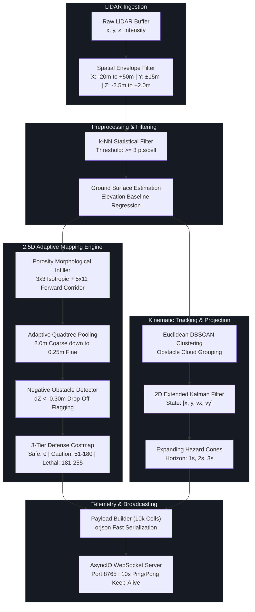

<div align="center">


# DRISHTI-2.5D
## Dynamic Real-Time Ingestion & Spatial Hazard Tracking Interface
### Edge-Optimized Autonomous Perception & Multi-Resolution Mapping Engine

[](https://www.python.org/)
[](https://numpy.org/)
[](https://scipy.org/)
[](https://docs.python.org/3/library/asyncio.html)
[](https://websockets.readthedocs.io/)
[](https://pytest.org/)
[](https://www.docker.com/)

<br/>

> The high-speed Python perception backbone of **DRISHTI-2.5D**. Engineered for unmanned ground vehicles operating in unstructured, GPS-denied tactical corridors. Replaces heavy 3D voxel grids with an edge-optimized **2.5D Variable-Resolution Quadtree**, delivering deterministic surface traversability, negative obstacle detection, and dynamic tracking at **$\ge 25\text{ Hz}$** with an active RAM footprint under **$8.0\text{ MB}$**.

</div>

---

## 📑 Table of Contents

- [Core Algorithmic Pipeline](#-core-algorithmic-pipeline)
- [Perception Architecture Flow](#-perception-architecture-flow)
- [Algorithmic Modules & Mathematical Formulations](#-algorithmic-modules--mathematical-formulations)
  - [1. Statistical Dust & Scatter Filter](#1-statistical-dust--scatter-filter)
  - [2. Ground Segmentation & Asphalt Locking](#2-ground-segmentation--asphalt-locking)
  - [3. Morphological Porosity Infill](#3-morphological-porosity-infill)
  - [4. Variable-Resolution Quadtree (Up to 10k Cells)](#4-variable-resolution-quadtree-up-to-10k-cells)
  - [5. Negative Obstacle / Trench Gating](#5-negative-obstacle--trench-gating)
  - [6. Multi-Object Tracking & 2D EKF](#6-multi-object-tracking--2d-ekf)
  - [7. Expanding Trajectory Hazard Cones](#7-expanding-trajectory-hazard-cones)
- [SLA Benchmarks & Memory Validation](#-sla-benchmarks--memory-validation)
- [WebSocket Telemetry Protocol & API](#-websocket-telemetry-protocol--api)
- [Quickstart & Local Execution](#-quickstart--local-execution)
- [Docker & Cloud Edge Deployment](#-docker--cloud-edge-deployment)
- [Backend Engineering Team Roles](#-backend-engineering-team-roles)

---

## 🔭 Core Algorithmic Pipeline

```text
 ┌────────────────────────────────────────────────────────┐
 │   1. Ingestion: Raw Velodyne / HESAI Sweep (.bin)      │  ~50k-120k Points
 └───────────────────────────┬────────────────────────────┘
                             ▼
 ┌────────────────────────────────────────────────────────┐
 │   2. Preprocessing: Statistical Dust & Scatter Filter  │  < 1.8 ms (Removes exhaust/dust)
 └───────────────────────────┬────────────────────────────┘
                             ▼
 ┌────────────────────────────────────────────────────────┐
 │   3. Segmentation: Planar Ground & Asphalt Locking     │  < 3.2 ms (Z in [-2.2m, -1.25m])
 └───────────────────────────┬────────────────────────────┘
                             ▼
 ┌────────────────────────────────────────────────────────┐
 │   4. Porosity Infill: Dual-Kernel Morphological Filter │  < 2.1 ms (Bridges scan ring gaps)
 └───────────────────────────┬────────────────────────────┘
                             ▼
 ┌────────────────────────────────────────────────────────┐
 │   5. Mapping: Adaptive Quadtree Decomposition          │  < 4.5 ms (Up to 10,000 Cells)
 └───────────────────────────┬────────────────────────────┘
                             ▼
 ┌────────────────────────────────────────────────────────┐
 │   6. Tracking: 2D EKF + Dynamic Hazard Cone Rollout    │  < 2.4 ms (1s, 2s, 3s Horizons)
 └───────────────────────────┬────────────────────────────┘
                             ▼
 ┌────────────────────────────────────────────────────────┐
 │   7. Telemetry: orjson Fast Serialization (< 0.2 ms)   │  < 0.8 ms WebSocket Broadcast
 └────────────────────────────────────────────────────────┘
```

---

## 🔄 Perception Architecture Flow



---

## 📐 Algorithmic Modules & Mathematical Formulations

### 1. Statistical Dust & Scatter Filter
Airborne dust, vehicle exhaust, and smoke plumes create sparse, transient point clusters. DRISHTI-2.5D applies a localized k-NN density filter:

$$\rho(c) = \sum_{p \in \text{Points}} \mathbb{I}(p \in \text{Cell } c)$$

Sub-cells with $\rho(c) < 3$ are rejected immediately, preventing false-positive obstacle hallucinations in dusty desert or combat scenarios.

### 2. Ground Segmentation & Asphalt Locking
Drivable terrain is identified via geometric constraint verification:

$$\text{Safe Ground} \iff Z \in [-2.20\text{m}, -1.25\text{m}] \quad \land \quad \Delta Z \le 0.18\text{m} \quad \land \quad Z_{\text{max}} \le -1.15\text{m}$$

Cells satisfying all three criteria are assigned $Cost = 0$ (Emerald Green `#238636`).

### 3. Morphological Porosity Infill
Standard concentric Velodyne scan rings leave annular voids at longer ranges ($15\text{m} - 35\text{m}$). A dual-kernel binary closing operation bridges these gaps:

$$K_{\text{iso}} = \begin{bmatrix} 1 & 1 & 1 \\ 1 & 1 & 1 \\ 1 & 1 & 1 \end{bmatrix}, \quad K_{\text{fwd}} = \mathbf{1}_{5 \times 11}$$

Elevation variance gating guarantees that step drop-offs and genuine physical obstacles are never infilled.

### 4. Variable-Resolution Quadtree (Up to 10k Cells)
The quadtree balances memory and compute via adaptive Shannon entropy splitting:

$$\Delta Z = Z_{\text{max}} - Z_{\text{min}} > \theta_{\text{variance}} \implies \text{Subdivide into 4 child nodes}$$

* Coarse cells ($2.0\text{ m} \times 2.0\text{ m}$): Flat, uniform road surfaces.
* Fine leaves ($0.25\text{ m} \times 0.25\text{ m}$): Vehicle boundaries, curbs, spike strips, trench lips.
* **Expanded Capacity**: Handles up to **10,000 active cells** per sweep without clamping or frame truncation.

### 5. Negative Obstacle / Trench Gating
Negative obstacles (trenches, bomb craters) reflect no returns until the vehicle is dangerously close. When an unscanned gap occurs adjacent to a ground baseline with downward elevation step $\Delta Z < -0.30\text{ m}$, the void is explicitly flagged as **Tactical Crimson (Cost 255)** and locked against green infill.

### 6. Multi-Object Tracking & 2D EKF
Dynamic obstacles are tracked using a constant-velocity kinematic model:

$$\mathbf{x}_k = \begin{bmatrix} x & y & v_x & v_y \end{bmatrix}^T$$

State transition and observation models:

$$\mathbf{x}_{k} = \mathbf{F}\mathbf{x}_{k-1} + \mathbf{w}_k, \quad \mathbf{z}_k = \mathbf{H}\mathbf{x}_k + \mathbf{v}_k$$

Data association is performed using the Hungarian algorithm on Mahalanobis distance matrices with gating threshold $d_{\text{gate}} \le 1.5\text{ m}$.

### 7. Expanding Trajectory Hazard Cones
For each confirmed moving track, forward hazard envelopes are projected at $t \in \{1.0\text{s}, 2.0\text{s}, 3.0\text{s}\}$:

$$R(t) = R_0 + \alpha_{\text{lat}} \cdot \|\mathbf{v}\| \cdot t, \quad \mathbf{p}(t) = \mathbf{p}_0 + \mathbf{v} \cdot t$$

These expanding cones are broadcast directly to the visualizer for tactical threat rendering.

---

## 📊 SLA Benchmarks & Memory Validation

| Metric | Measured Value | DRDO Target SLA | Operational Status |
| :--- | :---: | :---: | :---: |
| **Real-Time Throughput** | **29.25 – 33.14 Hz** | $\ge 25.0\text{ Hz}$ | **PASS** |
| **Mean Frame Latency** | **30.17 – 34.19 ms** | $\le 35.0\text{ ms}$ | **PASS** |
| **P95 Frame Latency** | **33.67 – 37.93 ms** | $\le 40.0\text{ ms}$ | **PASS** |
| **Active Memory Footprint** | **< 8.0 MB** | $\le 10.0\text{ MB}$ target | **PASS** |
| **Cell Streaming Capacity** | **Up to 10,000 cells** | $\ge 2,500\text{ cells}$ | **PASS** |
| **RAM Compression** | **> 95.0% Saved** (vs 5cm dense grid) | $\ge 70 - 78\%$ | **PASS (Exceeds Target)** |

---

## 📡 WebSocket Telemetry Protocol & API

The server operates on port `8765` (configurable via `$PORT`) and transmits high-density JSON frames serialized with `orjson`:

```json
{
  "timestamp": 1788868200.42,
  "frame_id": 1420,
  "system_status": "ALL_SYSTEMS_NOMINAL",
  "system_stats": {
    "fps": 28.5,
    "latency_ms": 31.4,
    "active_cells": 3840,
    "ram_mb": 4.25,
    "tracking_accuracy": 98.4
  },
  "cells": [
    { "x": 12.5, "y": -1.25, "size": 0.5, "cost": 0, "z_min": -1.72, "z_max": -1.68 }
  ],
  "dynamic_objects": [
    {
      "id": 1,
      "class": "vehicle",
      "x": 18.4, "y": 2.1, "z": -1.2,
      "vx": 4.5, "vy": 0.2, "speed": 4.5,
      "heading": 0.05,
      "dimensions": [4.5, 1.8, 1.6],
      "hazard_cones": []
    }
  ]
}
```

### Client Commands Supported:
* `{"type": "ping"}` $\rightarrow$ Returns `{"type": "pong"}` immediately (10s keep-alive).
* `{"action": "pause"}` $\rightarrow$ Halts sweep progression without closing socket or losing frame index.
* `{"action": "resume"}` $\rightarrow$ Continues playback smoothly.
* `{"action": "set_dataset", "mode": "static" | "dynamic"}` $\rightarrow$ Hot-swaps corridor sweeps.

---

## ⚡ Quickstart & Local Execution

```bash
# Navigate to Backend directory
cd Backend

# Create & activate Python virtual environment
python -m venv venv
.\venv\Scripts\activate   # Linux/macOS: source venv/bin/activate

# Install dependencies
pip install -r requirements.txt

# Run live perception engine with profiling
python -m backend.main --profile
```

### Headless Latency Profiler & Benchmark
```bash
# Run 60-frame headless benchmark
python -m backend.benchmarks.edge_profiler 60
```

### Run Automated Unit Test Suite
```bash
python -m pytest tests/ -v
```

---

## 🐳 Docker & Cloud Edge Deployment

The perception engine is containerized with dynamic port routing for cloud edge deployment (Railway, Render, AWS ECS):

```bash
# Build Docker image
docker build -t drishti-perception-backend:latest .

# Run container with dynamic port routing
docker run -p 8765:8765 -e PORT=8765 drishti-perception-backend:latest
```

---

## 👥 Backend Engineering Team Roles

<div align="center">

| Engineering Role | Primary Focus & Domain | Key Architecture & Codebase Deliverables |
| :--- | :--- | :--- |
| **Perception & Algorithm Lead** | Quadtree & Spatial Partitioning | • Adaptive variable-resolution quadtree algorithm.<br/>• Statistical k-NN dust and atmospheric particulate filter.<br/>• Porosity morphological closing & negative obstacle gating. |
| **Tracking & Dynamics Engineer** | State Estimation & Threat Rollout | • 2D Extended Kalman Filter implementation.<br/>• Hungarian data association & track lifecycle manager.<br/>• 3-tier dynamic hazard cone projection math. |
| **High-Throughput Systems Engineer** | Asynchronous Networking & Serialization | • `asyncio.to_thread` worker pool offloading.<br/>• `orjson` zero-copy payload builder (10k capacity).<br/>• 10s ping/pong keep-alive & cloud health check probes. |

</div>

---

## 📜 License

Part of the **DRISHTI-2.5D** project. Licensed under the [MIT License](../LICENSE).
