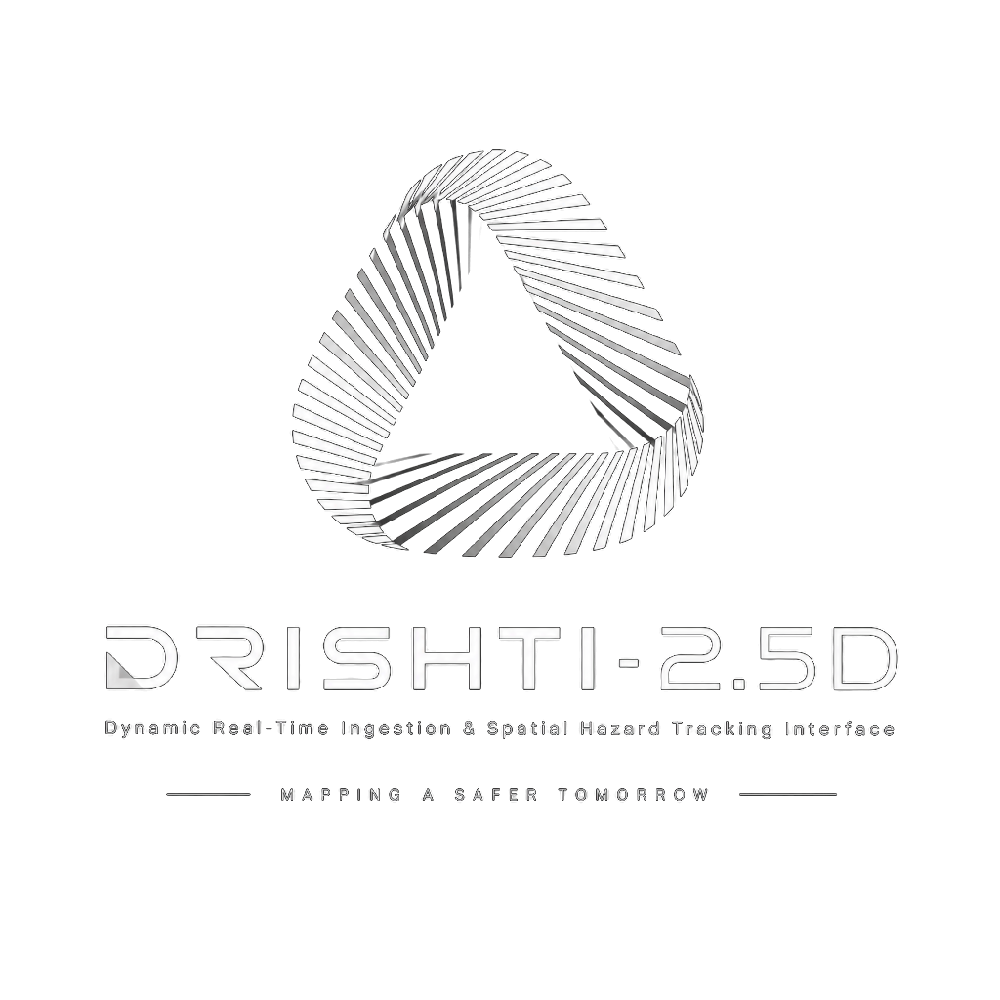
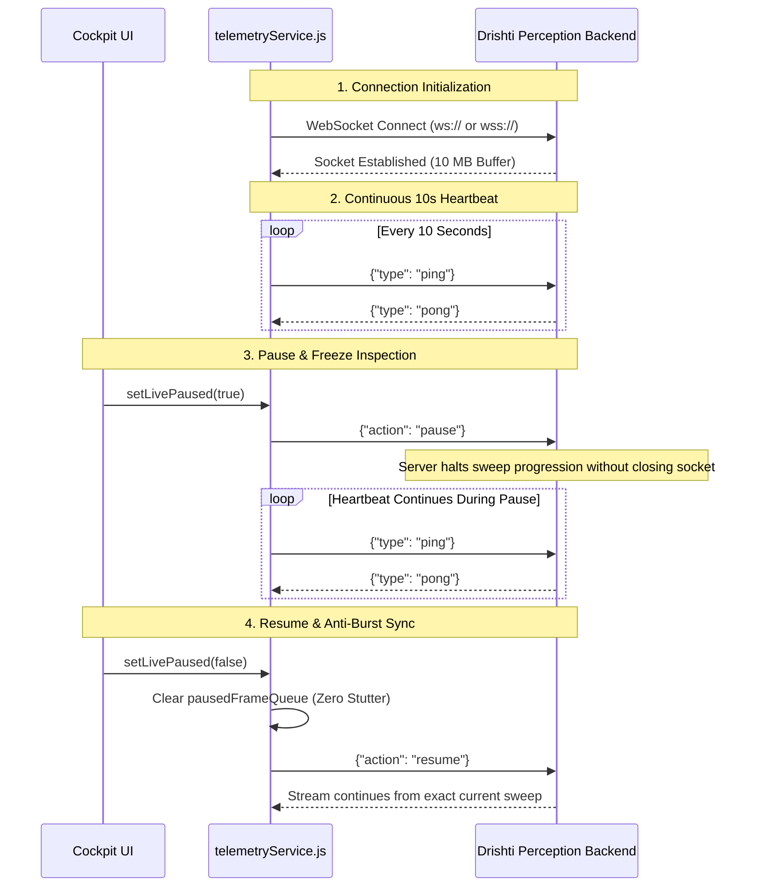

<div align="center">



# DRISHTI-2.5D
## Dynamic Real-Time Ingestion & Spatial Hazard Tracking Interface
### Tactical WebGL 2.0 Visualizer & High-Fidelity Perception Cockpit

[](https://react.dev/)
[](https://threejs.org/)
[](https://vitejs.dev/)
[](https://developer.mozilla.org/en-US/docs/Web/API/WebSocket)
[](https://threejs.org/docs/#api/en/objects/InstancedMesh)
[](https://opensource.org/licenses/MIT)

<br/>

> High-throughput, edge-responsive 3D/2.5D visualization dashboard for the **DRISHTI-2.5D** autonomous perception engine. Built with **React 18**, **Vite 6**, and **Three.js (r128)**, it provides zero-lag GPU-instanced terrain rendering, tactical 3-tier defense threat colormaps, dynamic vehicle bounding boxes, and velocity-projected hazard cones.

</div>

---

## 📑 Table of Contents

- [Cockpit Overview & Capabilities](#-cockpit-overview--capabilities)
- [GPU Instanced Rendering Pipeline](#-gpu-instanced-rendering-pipeline)
- [3-Tier Tactical Defense Colormap](#-3-tier-tactical-defense-colormap)
- [WebSocket Telemetry & Keep-Alive Architecture](#-websocket-telemetry--keep-alive-architecture)
- [Dual-Mode Perception Synchrony](#-dual-mode-perception-synchrony)
- [HUD Controls & Keybindings](#-hud-controls--keybindings)
- [Quickstart & Development Guide](#-quickstart--development-guide)
- [Production Build & Optimization](#-production-build--optimization)
- [Frontend Engineering Team Roles](#-frontend-engineering-team-roles)

---

## 🔭 Cockpit Overview & Capabilities

The **DRISHTI-2.5D Frontend** delivers tactical situational awareness to autonomous vehicle operators and mission controllers:

* **Dense 360° LiDAR Point Cloud**: Direct rendering of raw Velodyne/HESAI point sweeps (`THREE.Points`) with elevation-mapped color ramps.
* **10,000+ Adaptive Cell Capacity**: Dynamically allocates GPU memory to render full-sweep quadtree structures without artificial truncation.
* **Continuous Keep-Alive Heartbeat**: Sends `{"type": "ping"}` every 10 seconds to keep edge reverse proxies (Railway, Render, AWS ALB) active indefinitely during paused inspection.
* **Anti-Burst Resume**: Frame queues are discarded on resume, preventing rapid fast-forward stuttering when transitioning from paused to live state.
* **Procedural Simulation Fallback**: Zero-dependency offline procedural road corridor generator for air-gapped demoing or network disconnects.

---

## ⚡ GPU Instanced Rendering Pipeline

To sustain $\ge 60\text{ FPS}$ with up to 10,000 active quadtree cells, the renderer avoids individual mesh draw calls by utilizing **`THREE.InstancedMesh`**:

```text
 ┌────────────────────────────────────────────────────────┐
 │            Single Unit Box Geometry (1m x 1m x 1m)     │
 └───────────────────────────┬────────────────────────────┘
                             │
            ┌────────────────┴────────────────┐
            ▼                                 ▼
   Matrix4 Instancing Buffer         Instanced Color Buffer
  [Position (X,Y,Z), Scale(Sx,Sy,Sz)] [RGB 3-Tier Defense Palette]
            │                                 │
            └────────────────┬────────────────┘
                             │
                             ▼
 ┌────────────────────────────────────────────────────────┐
 │       THREE.InstancedMesh (Capacity: 12,000 Slots)     │
 │            Single Draw Call for Entire Terrain         │
 └────────────────────────────────────────────────────────┘
```

* **Dynamic Capacity Scaling**: Starts with a minimum allocated capacity of 12,000 instances, growing on demand to ensure large sweeps are never clipped.
* **Elevation Gating**: Cell footprints scale dynamically to represent adaptive quadtree cell sizes ($0.25\text{m}$, $0.5\text{m}$, $1.0\text{m}$, $2.0\text{m}$).

---

## 🛡️ 3-Tier Tactical Defense Colormap

The visualizer enforces an unambiguous military colormap contract:

<div align="center">

| Cost Range | Visual Color | Hex Code | Classification & Physical Meaning |
| :---: | :---: | :---: | :--- |
| **0 – 50** | **Emerald Green** | `#238636` | **Confirmed Safe Ground**: Flat asphalt, drivable pavement ($\Delta Z \le 0.18\text{m}$). |
| **51 – 180** | **Solar Amber** | `#D29922` | **Caution Transition**: Mild slopes, gravel shoulders, unscanned shadow margins. |
| **181 – 255** | **Tactical Crimson** | `#F85149` | **Lethal Obstacle**: Physical obstacles, vehicles, barricades, anti-tank ditches. |

</div>

> [!IMPORTANT]
> **Ceiling Clearance Gate**: Any return above $-1.15\text{ m}$ elevation violates vehicle chassis clearance and is strictly prevented from rendering green, even if flat.

---

## 📡 WebSocket Telemetry & Keep-Alive Architecture

All communication flows through [`src/services/telemetryService.js`](src/services/telemetryService.js):



* **Heartbeat Timer**: `ensureHeartbeat()` runs on an unbreakable 10-second interval.
* **Debounced Dataset Hot-Swap**: 300 ms debounce prevents socket flooding when rapidly clicking between `[STATIC]` and `[DYNAMIC]` datasets.

---

## 🔀 Dual-Mode Perception Synchrony

The cockpit supports seamless toggling between three analytical modes:

1. **Mode 1: Spectral Elevation LiDAR**: Raw 3D point cloud colored by vertical elevation gradient (Blue $\rightarrow$ Cyan $\rightarrow$ Green $\rightarrow$ Yellow $\rightarrow$ Red).
2. **Mode 2: 2.5D Adaptive Mapping**: Discrete 3-tier defense tiles reflecting local surface variance and step heights.
3. **Mode 3: Semantic Hazard Intelligence**: 2.5D grid overlaid with classified dynamic vehicles, pedestrians, and expanding $1\text{s}, 2\text{s}, 3\text{s}$ hazard cones.

---

## 🎮 HUD Controls & Keybindings

<div align="center">

| Key | Control Action | Functional Description |
| :---: | :--- | :--- |
| <kbd>1</kbd> | **Mode 1: Raw LiDAR** | View high-resolution 3D LiDAR point returns with elevation gradient. |
| <kbd>2</kbd> | **Mode 2: 2.5D Adaptive** | View variable-resolution terrain tiles with 3-tier defense costmap. |
| <kbd>3</kbd> | **Mode 3: Semantic Intelligence**| View dynamic vehicle bounding boxes and hazard trajectory cones. |
| <kbd>Space</kbd> | **Play / Pause** | Freeze/unfreeze the telemetry stream without losing WebSocket connection. |
| <kbd>R</kbd> | **Reset Camera** | Realign orbit camera to standard ego-vehicle chase perspective. |
| <kbd>[</kbd> / <kbd>]</kbd> | **Playback Speed** | Scale playback pacing ($0.25\times, 0.5\times, 1.0\times, 2.0\times$). |
| <kbd>D</kbd> | **Dataset Hot-Swap** | Toggle between Static Urban Corridor and Dynamic Multi-Object Tracking. |

</div>

---

## ⚡ Quickstart & Development Guide

### Prerequisites
* **Node.js**: `v18.0+` or `v20.0+`
* **npm**: `v9.0+`

### Installation & Local Run
```bash
# Navigate to frontend directory
cd Frontend

# Install dependencies
npm install

# Start Vite development server
npm run dev
```

Open **`http://localhost:5173`** in your browser.

---

## 📦 Production Build & Optimization

To compile the production-ready distribution bundle:

```bash
# Validate JSX and build bundle
npm run build

# Preview production build locally
npm run preview
```

Production output is compiled into the `Frontend/dist/` directory with code splitting and minification.

---

## 👥 Frontend Engineering Team Roles

<div align="center">

| Engineering Role | Primary Focus & Domain | Key Architecture & Codebase Deliverables |
| :--- | :--- | :--- |
| **WebGL & Graphics Lead** | Three.js Core & Shaders | • `InstancedMesh` 12k capacity GPU rendering pipeline.<br/>• 3-tier defense colormap shaders & elevation gating.<br/>• Custom camera controls and chase-view orbit navigation. |
| **Frontend State & UI Engineer** | React 18 & HUD Cockpit | • `MetricsPanel`, `SceneControls`, and `Header` HUD components.<br/>• Throttled 10 Hz React state dispatch preventing UI lockups.<br/>• Responsive layout supporting split desktop & mobile views. |
| **Telemetry & Network Specialist** | WebSocket Protocol & Sync | • Permanent 10s keep-alive ping/pong heartbeat timer.<br/>• Anti-burst resume buffer resetting to prevent frame skip.<br/>• Procedural simulation fallback engine for offline demos. |

</div>

---

## 📜 License

Part of the **DRISHTI-2.5D** project. Licensed under the [MIT License](../LICENSE).
