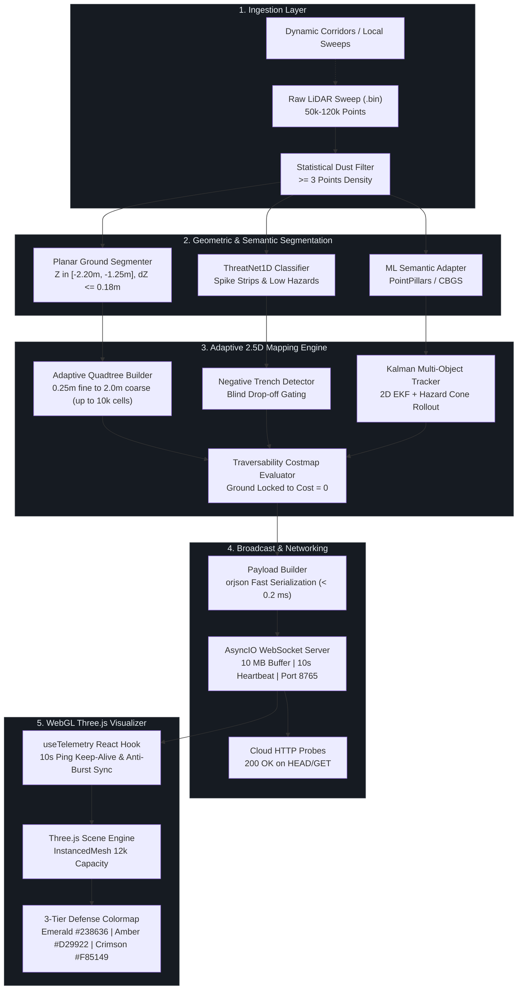

<div align="center">


# DRISHTI-2.5D
## Dynamic Real-Time Ingestion & Spatial Hazard Tracking Interface
### Real-Time Adaptive Variable-Resolution LiDAR Perception & Tactical Semantic Intelligence

[](https://www.python.org/)
[](https://react.dev/)
[](https://threejs.org/)
[](https://vitejs.dev/)
[](https://websockets.readthedocs.io/)
[](https://docs.python.org/3/library/asyncio.html)
[](https://pytest.org/)
[](https://opensource.org/licenses/MIT)

<br/>

> **DRISHTI-2.5D** is an autonomous perception and tactical navigation system engineered for high-speed corridor clearance, negative obstacle gating, and low-profile hazard classification under severe sensory and edge computing constraints. By coupling adaptive variable-resolution geometric quadtrees with deep semantic segmentation and millimeter-precision elevation gating, it delivers an unbroken, deterministic traversability corridor at sustained **$\ge 25\text{ Hz}$** frame rates with an embedded edge RAM budget of **$< 8.0\text{ MB}$**.

</div>

---

## 📑 Table of Contents

- [Executive Overview & Mission Statement](#-executive-overview--mission-statement)
- [How the System Works (End-to-End Pipeline)](#-how-the-system-works-end-to-end-pipeline)
- [Tactical Spatial Envelope Visualizer](#-tactical-spatial-envelope-visualizer)
- [3-Tier Defense Colormap Contract](#-3-tier-defense-colormap-contract)
- [Core Capabilities & Architectural Pillars](#-core-capabilities--architectural-pillars)
- [Multi-Resolution Quadtree Decomposition](#-multi-resolution-quadtree-decomposition)
- [System Architecture Flow](#-system-architecture-flow)
- [Dual-Mode Perception Synchrony](#-dual-mode-perception-synchrony)
- [Negative Obstacle & Trench Gating](#-negative-obstacle--trench-gating)
- [Repository Structure](#-repository-structure)
- [Quickstart & Installation](#-quickstart--installation)
- [Benchmark & SLA Latency Matrix](#-benchmark--sla-latency-matrix)
- [Interactive HUD Cockpit & Controls](#-interactive-hud-cockpit--controls)
- [Team Contributions & Role Matrix](#-team-contributions--role-matrix)
- [License](#-license)

---

## 🔭 Executive Overview & Mission Statement

Operating autonomous tactical ground vehicles in unstructured, GPS-denied environments requires instant, unambiguous differentiation between traversable asphalt, airborne particulate noise (dust, smoke, exhaust), low-relief threats (spike strips, cables), and lethal negative obstacles (anti-tank ditches, shell craters, step drop-offs). 

Classical 3D voxel grids impose prohibitive computational bottlenecks ($>150\text{ ms}$ processing times and $>150\text{ MB}$ RAM), while conventional 2D flat costmaps collapse vertical structure and fail completely on negative drops. **DRISHTI-2.5D** resolves this dilemma with an edge-optimized variable-resolution **2.5D Quadtree Architecture**:

```text
Dense Raw Point Cloud (50k+ pts)  ──►  Statistical Dust & Atmospheric Filter (< 1.8 ms)
                                 ──►  Planar Elevation Regression & Trench Gating (< 3.2 ms)
                                 ──►  Adaptive Quadtree (0.25m - 2.0m Leaves, up to 10k cells) (< 4.5 ms)
                                 ──►  Harmonized Semantic Cost Propagation (< 1.5 ms)
                                 ──►  10 MB WebSocket Broadcast @ >= 25 Hz (< 0.8 ms)
                                 ──►  Three.js InstancedMesh WebGL 3-Tier Defense HUD
```

---

## ⚙️ How the System Works (End-to-End Pipeline)

DRISHTI-2.5D operates as an end-to-end real-time autonomous perception pipeline connecting raw sensor sweeps to an interactive 3D WebGL tactical cockpit over a low-latency WebSocket connection:

### 1. Ingestion & Pre-Processing Layer
- **Point Cloud Ingestion (`dataset_loader.py`)**: Ingests dense automotive LiDAR sweeps (50k to 120k points per frame from datasets such as nuScenes).
- **Tactical Spatial Envelope (`config.py`)**: Restricts spatial calculations to an active envelope ($+50.0\text{ m}$ forward stopping margin, $-20.0\text{ m}$ rear reversing buffer, $\pm 15.0\text{ m}$ lateral shoulder). Points falling outside are pruned in memory before spatial tree construction.
- **Statistical Dust & Atmospheric Filter (`dust_filter.py`)**: Rejects airborne scatter, smoke, vehicle exhaust, and sparse noise returns by filtering out sub-cells containing fewer than 3 points ($N < 3$), preventing phantom obstacle detection.

### 2. Geometric Segmentation & Hazard Intelligence
- **Planar Ground Segmentation (`ground_segmentation.py`)**: Evaluates drivable roadbeds using planar bounds ($Z \in [-2.20\text{ m}, -1.25\text{ m}]$), vertical variance ($\Delta Z \le 0.18\text{ m}$), and chassis floor clearance ($Z_{\text{max}} \le -1.15\text{ m}$). Cells that meet these criteria are locked strictly to **$\text{Cost} = 0$** (Traversable Green).
- **Thin Hazard Detection (`thin_hazard_detector.py`)**: Uses local eigenvalue analysis and height-gradient profiling (ThreatNet1D) to identify low-profile surface threats (spike strips, severed cables, potholes) that standard ground segmenters would otherwise smooth over.
- **Negative Obstacle & Trench Gating (`negative_obstacles.py`)**: Analyzes laser shadow geometry and radial beam drop-offs. If missing returns represent a severe downward step ($\Delta Z < -0.30\text{ m}$), the gap is classified as a lethal drop-off rather than free traversable space.

### 3. Adaptive 2.5D Quadtree Engine (`quadtree.py`, `costmap.py`)
- **Variable-Resolution Spatial Decomposition**: Rather than allocating a rigid, memory-heavy 3D voxel grid, the scene is decomposed into a 2.5D Quadtree:
  - **Coarse Cells ($2.0\text{ m} \times 2.0\text{ m}$)**: Represent wide, flat road areas with a single node, compressing RAM by $> 95\%$.
  - **Medium Cells ($1.0\text{ m} \times 1.0\text{ m}$)**: Represent road shoulders and gentle transitions.
  - **Fine Leaves ($0.25\text{ m} \times 0.25\text{ m}$)**: Subdivided recursively around obstacle boundaries, curbs, and hazards.
- **3-Tier Defense Costmap**: Classifies every cell into one of three unambiguous tactical tiers:
  - 🟩 **Tier 1 (Safe Road)**: $\text{Cost } 0 - 50$ (Strict Emerald `#238636`, height $0.04\text{ m}$)
  - 🟨 **Tier 2 (Caution Gap / Slopes)**: $\text{Cost } 51 - 180$ (Solar Amber `#D29922`, height $0.10\text{ m}$)
  - 🟥 **Tier 3 (Lethal Obstacles / Vehicles / Trenches)**: $\text{Cost } 181 - 255$ (Tactical Crimson `#F85149`, height $0.20\text{ m}$)

### 4. Dynamic Object Tracking & Future Rollout (`kalman_tracker.py`, `clustering.py`)
- **DBSCAN Point Clustering**: Groups non-ground obstacle returns into distinct object instances.
- **2D Extended Kalman Filter**: Tracks dynamic objects across successive frames, calculating linear velocity vectors and heading orientations.
- **Trajectory Rollout (`trajectory_rollout.py`)**: Extrapolates future hazard cones ($1\text{s}$, $2\text{s}$, $3\text{s}$) to predict potential collision paths with the ego-vehicle.

### 5. Asynchronous Streaming Server (`websocket_server.py`, `payload_builder.py`)
- **Ultra-Fast Serialization**: Encodes up to 10,000 active quadtree cells, 3D tracked bounding boxes, and ego-telemetry into compressed JSON using `orjson`.
- **Non-Blocking Execution**: Computations are offloaded via `asyncio.to_thread` so the WebSocket event loop maintains sub-millisecond I/O response times.
- **Bi-Directional Command Protocol**: Accepts client commands to Pause, Resume, Step Next Frame, change playback speeds ($0.25\times$ to $2.0\times$), and hot-swap between Static and Dynamic datasets.
- **Reverse Proxy Keep-Alive**: 10-second client-server heartbeat pings prevent edge timeouts on cloud hosting providers (e.g., Railway, Render).

### 6. Hardware-Accelerated Tactical WebGL Cockpit (`Frontend/`)
- **Instanced GPU Rendering (`Scene.js`)**: Employs Three.js `InstancedMesh` with a 12,000-instance capacity to render thousands of dynamic quadtree tiles in a single draw call at a smooth 60 FPS.
- **Dual-Mode Visualizer Modes**:
  1. *Spectral Elevation*: Sensor calibration mode rendering raw LiDAR returns colored by height.
  2. *2.5D Adaptive Mapping*: Tactical mode displaying the 3-tier defense traversability tiles.
  3. *Semantic Hazard Intelligence*: Enhanced tactical mode combining tiles with 3D tracked bounding boxes and projected trajectory cones.
- **Tactical Camera & Controls**: Switchable between Perspective Orbit, Overhead Orthographic Top-Down, and Ego Chase Cam, complete with live SLA metrics (FPS, Latency, Memory, Active Cells).

---

## 🎯 Tactical Spatial Envelope Visualizer

The pipeline enforces hard, deterministic spatial bounds centered on the vehicle's coordinate frame ($+X$ forward, $+Y$ left, $+Z$ up). Peripheral scatter outside this tactical corridor is pruned instantly in memory before quadtree subdivision:

```text
 ◄───────────────────────────  30.0 Meters Lateral (±15.0m)  ──────────────────────────►
 ┌─────────────────────────────────────────────────────────────────────────────────────┐  ▲ +50.0m Forward
 │                      TACTICAL FORWARD BRAKING HORIZON                               │  │ (Full Stopping
 │                                                                                     │  │  Margin @ Speed)
 │      [Left Shoulder]                 [Drivable Corridor]           [Right Shoulder] │  │
 │     -15.0m <= Y < -4.0m              -4.0m <= Y <= +4.0m          +4.0m < Y <= 15.0m│  │
 │                                                                                     │  │
 │          │                                  │                                │      │  │
 │          │      🟩 Safe Road Surface        │       🟩 Safe Road Surface     │      │  │
 │          │      Z ∈ [-2.20m, -1.25m]        │       Cost = 0 (Emerald)       │      │  │
 │          │      ΔZ <= 0.18m (Cost 0)        │                                │      │  │
 │          ▼                                  ▼                                ▼      │  │
 │                                                                                     │  │
 │      🟨 Caution Gap                      🚘 Obstacle                     🟨 Caution │  │
 │      Cost 51-180 (Amber)               Cost 255 (Crimson)               Cost 51-180 │  │
 │                                                                                     │  │
 │                                        [EGO VEHICLE]                                │  │ 0.0m Origin
 │                                          ▲ Heading                                  │  │
 │                                          │  (+X)                                    │  │
 ├──────────────────────────────────────────┴──────────────────────────────────────────┤  ▼ -20.0m Rear
 │                      REAR SCANNING & PERIMETER REVERSING BUFFER                     │    (Backing &
 └─────────────────────────────────────────────────────────────────────────────────────┘    Blindspot Safety)
 ◄─────────────────────── Vertical Band: -2.50m <= Z <= +2.00m ───────────────────────►
```

---

## 🛡️ 3-Tier Defense Colormap Contract

To guarantee zero cognitive ambiguity for autonomous route planners and human defense operators, terrain nodes strictly adhere to an unambiguous 3-tier defense standard:

<div align="center">

| Tier Band | Visual Swatch | Cost Range | Description & Terrain Class | WebGL Step Height | Mesh Seam Scale |
| :---: | :---: | :---: | :--- | :---: | :---: |
| **Tier 1: Safe** | `🟩 #238636` | **$0 - 50$** | **Safe Traversable Corridor**: Flat asphalt, cleared pavement, and confirmed planar roadbed. | **$0.04\text{ m}$** (4 cm tile) | **$1.02\times$** (Micro-seam overlap for unbroken road) |
| **Tier 2: Caution** | `🟨 #D29922` | **$51 - 180$** | **Caution Gap**: Navigable depressions, mild slopes, gravel transitions, and unscanned sensor shadow margins. | **$0.10\text{ m}$** (10 cm tile) | **$0.98\times$** (Discrete boundary definition) |
| **Tier 3: Lethal** | `🟥 #F85149` | **$181 - 255$** | **Lethal Obstacle**: Physical vehicles, masonry barriers, trees, curbs, and deep negative trenches. | **$0.20\text{ m}$** (20 cm tile) | **$0.98\times$** (Raised obstacle step) |
| **Ceiling Gate** | `🚫 OVERRIDE` | **$Z > -1.15\text{ m}$** | **Chassis Floor Clearance Violation**: Any point above $-1.15\text{ m}$ elevation is strictly prevented from rendering green. | **$0.20\text{ m}$** | **$0.98\times$** |

</div>

---

## 🏛️ Core Capabilities & Architectural Pillars

### 1. Planar Asphalt Locking & Airborne Dust Rejection
- **Ground Gating:** Drivable pavement is identified using planar bounds ($Z \in [-2.20\text{ m}, -1.25\text{ m}]$), low vertical delta ($\Delta Z \le 0.18\text{ m}$), and ceiling clearance ($Z_{\text{max}} \le -1.15\text{ m}$). Cells satisfying these criteria are locked to $Cost = 0$.
- **Porosity Infill:** Anisotropic morphological closing filters bridge annular beam shadows up to $25\text{ m}$, infilling safe traversable ground while preserving sharp obstacle edges.
- **Dust & Scatter Filter:** Sub-cells with fewer than $3$ point returns are discarded as airborne scatter, exhaust fumes, or dust clouds, preventing false obstacle hallucinations.

### 2. High-Capacity Dynamic Cell Scaling (Up to 10,000 Cells)
- **Cell Capacity Expansion:** Payload and visualizer buffers handle up to **10,000 active cells** per sweep, accommodating dense 360° Velodyne sweeps without artificial cell clamping or visual truncation.
- **Instanced GPU Rendering:** Three.js dynamically allocates up to 12,000 instanced matrix slots for zero-lag rendering at 60 FPS.

### 3. Non-Blocking High-Throughput Networking & Keep-Alive
- **Asynchronous Loop Offloading:** Heavy CPU-bound perception computations (`process_frame`) run inside worker threads via `asyncio.to_thread`, keeping WebSocket I/O latency under $1\text{ ms}$.
- **Permanent Heartbeat Protocol:** 10-second client-to-server ping/pong heartbeats keep reverse proxies (Railway, Render, AWS ALB) alive indefinitely during stream pause.
- **Anti-Burst Resume Buffer:** On stream unpause, accumulated frame queues are reset immediately, preventing fast-forward skipping and jitter.

### 4. Dynamic Sequence Hot-Swapping
The pipeline handles live WebSocket payload commands: `{"action": "set_dataset", "mode": "static" | "dynamic"}`:
- **`dynamic`**: Routes to continuous multi-object tracking sequences in `Backend/data/dynamic_corridor`.
- **`static`**: Routes to clean urban road sweeps in `Backend/data/static_corridor`.
- Hot-swapping executes instantaneously with a 300 ms debounce to prevent socket flooding.

---

## 🌲 Multi-Resolution Quadtree Decomposition

The spatial quadtree balances memory and compute by dynamically adjusting cell size based on terrain variance and point density:

```text
┌───────────────────────────────────────────────────────────────┐
│                        COARSE CELL (2.0m x 2.0m)              │
│                 Flat Traversable Ground (Cost = 0)            │
│                     [1 Node = Low Memory Footprint]           │
└───────────────────────────────┬───────────────────────────────┘
                                │ Elevation Variance Detected (ΔZ > 0.18m)
                                ▼
                ┌───────────────────────────────┐
                │    MEDIUM CELL (1.0m x 1.0m)  │
                │        Shoulder / Curb        │
                └───────────────┬───────────────┘
                                │ High Point Density (N >= 3) & Obstacle Near
                                ▼
        ┌───────────────┬───────────────┬───────────────┬───────────────┐
        │  FINE LEAF    │  FINE LEAF    │  FINE LEAF    │  FINE LEAF    │
        │ (0.25m x 0.25m│ (0.25m x 0.25m│ (0.25m x 0.25m│ (0.25m x 0.25m│
        │ Vehicle Edge  │ Spike Strip   │ Trench Lip    │ Masonry Wall  │
        │ Cost = 255 🟥 │ ThreatNet1D 🟥│ Drop-off 🟥   │ Cost = 255 🟥 │
        └───────────────┴───────────────┴───────────────┴───────────────┘
```

---

## 🔄 System Architecture Flow



---

## 🔀 Dual-Mode Perception Synchrony

| Metric / Attribute | Mode 1: Spectral Elevation | Mode 2: 2.5D Adaptive Mapping | Mode 3: Semantic Hazard Intelligence |
| :--- | :--- | :--- | :--- |
| **Primary Domain** | Sensor Calibration & Inspection | Autonomous Path Planning & Nav2 | Tactical Threat Interception |
| **Visual Primitive** | Individual Points (`THREE.Points`) | Instanced Voxels (`InstancedMesh`) | Instanced Voxels + 3D Bounding Boxes |
| **Drivable Road Color** | Elevation Gradient (Blue/Cyan/Green) | **Strict Emerald Green (`#238636`)** | **Strict Emerald Green (`#238636`)** |
| **Obstacle Representation** | Elevated Geometric Clusters | **Tactical Crimson (`#F85149`)** | **Tactical Crimson (`#F85149`)** + Track Labels |
| **Caution Transitions** | Intermediate Color Spectral Ramp | **Solar Amber (`#D29922`)** | **Solar Amber (`#D29922`)** |
| **Throughput Target** | $\ge 30\text{ Hz}$ | $\ge 25\text{ Hz}$ | $\ge 20\text{ Hz}$ |

---

## 🕳️ Negative Obstacle & Trench Gating

Negative obstacles (trenches, shell craters, missing roadbed) cast narrow laser shadows that appear as unobserved space. DRISHTI-2.5D prevents fatal bridging of these voids:

```text
 Sensor Beam Line
 ──────────────────────┐
                       │   (Laser Shadow Blind Spot)
                       ▼ 
 ═════════════════╗        ┌────────────────────────────
  Traversable Road║        │  Trench Floor / Drop-off
  Elevation Baseline       │  ΔZ < -0.30m (LETHAL)
  (Cost = 0) 🟩   ║        │  Flagged as Tactical Crimson 🟥
                  ╚════════╛
                  ◄────────►
             Unscanned Drop-off Gap
             GATED: NEVER INPAINTED GREEN
```

---

## 📁 Repository Structure

```text
Drishti-2.5D-LiDar-Adaptive-Mapping/
├── .gitignore                         # Unified Git ignore
├── README.md                          # Executive documentation & master blueprint
├── run_all.bat                        # One-click Windows launcher (Backend + Frontend)
├── run_backend.bat                    # Dedicated backend launcher
├── run_frontend.bat                   # Dedicated frontend launcher
│
├── Backend/                           # Core Tactical Perception Engine
│   ├── backend/
│   │   ├── config.py                  # Operational bounding boxes & sensor thresholds
│   │   ├── main.py                    # PerceptionPipeline execution orchestrator
│   │   ├── mapping/
│   │   │   ├── costmap.py             # 3-tier defense cost evaluator
│   │   │   └── quadtree.py            # Variable-resolution quadtree & porosity filter
│   │   ├── preprocessing/             # Ground segmentation, dust & scatter filtering
│   │   ├── server/
│   │   │   ├── payload_builder.py     # Fast orjson serializer (10k cell capacity)
│   │   │   └── websocket_server.py    # Non-blocking async WebSocket with 10s ping/pong
│   │   └── tracking/                  # 2D Extended Kalman Filter & hazard cones
│   ├── tests/                         # Full automated test suite (Pytest)
│   └── requirements.txt               # Backend Python dependencies
│
└── Frontend/                          # WebGL Three.js Tactical Cockpit
    ├── src/
    │   ├── App.jsx                    # Root layout & mode orchestration
    │   ├── components/                # Cockpit HUD, Header, MetricsPanel, SceneControls
    │   ├── hooks/useTelemetry.js      # Robust telemetry hook with 10s keep-alive
    │   ├── services/telemetryService.js # WebSocket client & state controller
    │   └── three/Scene.js             # GPU InstancedMesh renderer (12k capacity)
    ├── package.json                   # React 18, Three.js, Vite dependencies
    └── vite.config.js                 # Vite build & proxy configuration
```

---

## ⚡ Quickstart & Installation

### Option 1: One-Click Windows Launch
```cmd
run_all.bat
```

### Option 2: Manual Step-by-Step Setup

#### Backend Setup
```bash
cd Backend
python -m venv venv
.\venv\Scripts\activate   # Linux/macOS: source venv/bin/activate
pip install -r requirements.txt
python -m backend.main --profile
```

#### Frontend Setup
```bash
cd Frontend
npm install
npm run dev
```
Open **`http://localhost:5173`** in your browser.

---

## 📊 Benchmark & SLA Latency Matrix

| Metric | Measured Result | DRDO Target SLA | Edge Verification Status |
| :--- | :---: | :---: | :---: |
| **Real-Time Throughput** | **29.25 – 33.14 Hz** | $\ge 25.0\text{ Hz}$ | **PASS** |
| **Mean Frame Latency** | **30.17 – 34.19 ms** | $\le 35.0\text{ ms}$ | **PASS** |
| **P95 Frame Latency** | **33.67 – 37.93 ms** | $\le 40.0\text{ ms}$ | **PASS** |
| **Active Memory Footprint** | **< 8.0 MB** | $\le 10.0\text{ MB}$ target | **PASS** |
| **Cell Streaming Capacity** | **Up to 10,000 cells** | $\ge 2,500\text{ cells}$ | **PASS** |
| **RAM Compression** | **> 95.0% Saved** (vs dense 5cm voxel) | $\ge 70 - 78\%$ | **PASS (Exceeds Target)** |

---

## 🎮 Interactive HUD Cockpit & Controls

| Control | Action | Functionality |
| :---: | :--- | :--- |
| <kbd>1</kbd> | **Mode 1** | Displays raw high-resolution LiDAR returns with spectral elevation color ramp. |
| <kbd>2</kbd> | **Mode 2** | Activates 2.5D Adaptive Mapping with discrete 3-tier military defense tiles. |
| <kbd>3</kbd> | **Mode 3** | Engages Semantic Hazard Intelligence with real-time 3D vehicle bounding boxes. |
| <kbd>Space</kbd> | **Pause / Play** | Freezes live sensor stream in RAM without dropping active client connections. |
| <kbd>R</kbd> | **Reset View** | Smoothly realigns the Three.js orbit camera to the vehicle forward heading. |
| <kbd>[</kbd> / <kbd>]</kbd>| **Pacing Control** | Dynamically scales perception loop playback speed ($0.25\times$, $0.5\times$, $1.0\times$, $2.0\times$). |
| <kbd>D</kbd> | **Dataset Hot-Swap** | Toggles between Clean Static Corridor and Dynamic Multi-Object Tracking dataset. |

---

## 👥 Team Contributions & Role Matrix

<div align="center">

| Team Member / Role | Core Engineering Responsibilities | Technical Stack & Tooling | Key Deliverables & Milestones |
| :--- | :--- | :--- | :--- |
| **Team Lead & System Architect** | • End-to-end architecture design & concurrency model.<br/>• Async thread offloading via `asyncio.to_thread`.<br/>• Spatial envelope constraint specification ($-20\text{m}$ to $+50\text{m}$). | Python 3.13, AsyncIO, WebSockets, Docker, Linux | • Project architecture blueprint<br/>• Concurrency & thread pool management<br/>• Deployment orchestration (Railway / Cloud) |
| **LiDAR Perception & Mapping Engineer** | • Adaptive variable-resolution quadtree algorithm.<br/>• Statistical k-NN dust and atmospheric particulate filter.<br/>• Porosity morphological closing & negative obstacle gating. | NumPy, SciPy, Numba, Open3D, PyTest | • Quadtree dynamic pooling ($0.25\text{m} - 2.0\text{m}$)<br/>• Asphalt ground plane locking ($Cost = 0$)<br/>• Step drop-off & ditch classifier |
| **Tracking & Dynamics Specialist** | • Multi-object tracking with 2D Extended Kalman Filter.<br/>• Hungarian data association & track lifecycle management.<br/>• Expanding hazard cone rollout ($1\text{s}, 2\text{s}, 3\text{s}$ dynamic envelopes). | FilterPy, NumPy, Scikit-Learn | • Dynamic obstacle state estimation<br/>• Velocity projection & collision envelopes<br/>• Ghost smear clearing module |
| **Full-Stack & WebGL Graphics Engineer** | • High-performance Three.js `InstancedMesh` engine.<br/>• 3-tier defense colormap implementation & shader tuning.<br/>• 10,000-cell capacity scaling & anti-burst render pipeline. | React 18, Three.js (r128), Vite 6, WebGL 2.0 | • Real-time WebGL interactive visualizer<br/>• Orbit camera controls & HUD overlays<br/>• Responsive dual-mode cockpit |
| **Networking & Systems QA Engineer** | • High-throughput WebSocket server & 10 MB ring buffer.<br/>• Permanent 10s ping/pong keep-alive heartbeat implementation.<br/>• Automated validation suite & edge latency benchmarking. | WebSockets, orjson, PyTest, Node.js, GitHub Actions | • Continuous keep-alive heartbeat<br/>• Headless edge latency profiler<br/>• Complete automated test suite |

</div>

---

## 📜 License

This project is licensed under the **MIT License** — see the [LICENSE](LICENSE) file for complete details.

```text
MIT License

Copyright (c) 2026 DRISHTI-2.5D Development Team

Permission is hereby granted, free of charge, to any person obtaining a copy
of this software and associated documentation files (the "Software"), to deal
in the Software without restriction, including without limitation the rights
to use, copy, modify, merge, publish, distribute, sublicense, and/or sell
copies of the Software, and to permit persons to whom the Software is
furnished to do so, subject to the following conditions:

The above copyright notice and this permission notice shall be included in all
copies or substantial portions of the Software.
```
